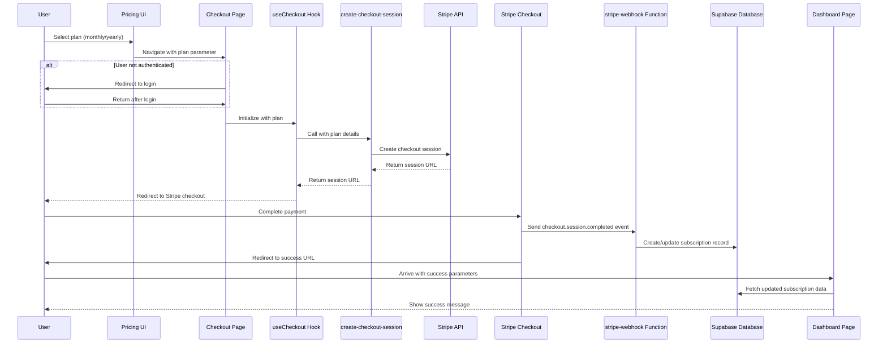
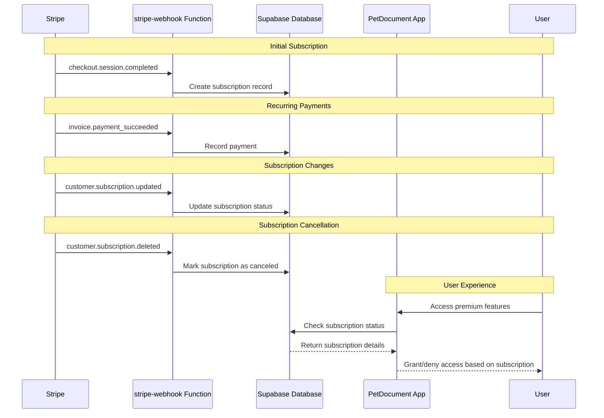
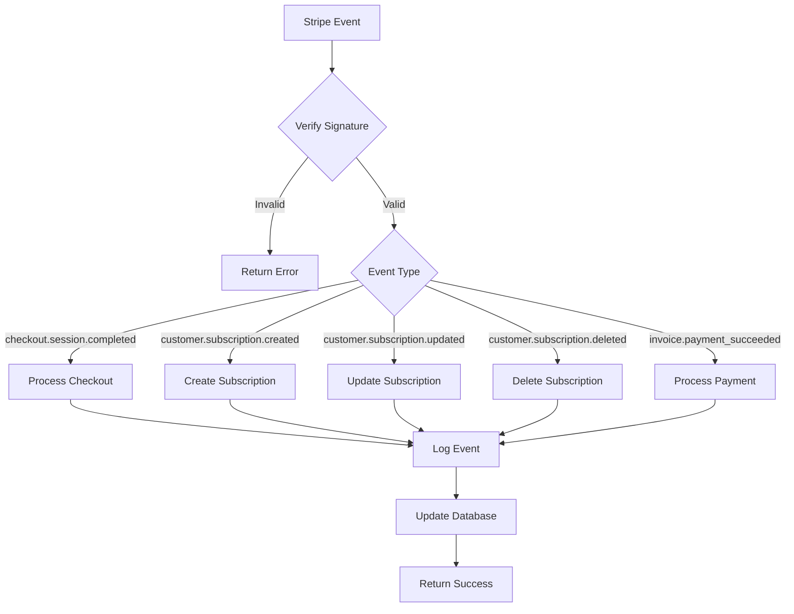

# Checkout Flow Implementation Summary

This document provides a summary of the implemented checkout flow in the PetDocument application, including the custom pricing UI, checkout process, and Stripe integration via Supabase Edge Functions.

## Overview

The checkout flow implementation includes:

1. Custom pricing UI with monthly and yearly subscription options
2. Seamless checkout process with proper authentication handling
3. Redirect to dashboard after successful checkout
4. Stripe webhook handling via Supabase Edge Functions
5. Database schema for subscription management

## Component Architecture

### Pricing Components

- `PricingPlans.tsx`: Displays pricing options with monthly and yearly plans
- `PricingCard.tsx`: Individual pricing card with plan details and subscribe button
- `useSubscription.ts`: Hook to handle subscription initiation and redirect to checkout

### Checkout Components

- `Checkout.tsx`: Main checkout page that initializes the checkout process
- `CheckoutCard.tsx`: Container for the checkout UI
- `PlanSummary.tsx`: Displays the selected plan details
- `CheckoutButton.tsx`: Handles the checkout button UI and loading state
- `CheckoutError.tsx`: Handles error display and retry functionality
- `useCheckout.ts`: Hook that manages the checkout process and Stripe integration

## Checkout Flow Logic

1. **Plan Selection**: User selects a plan (monthly or yearly) on the pricing page
2. **Authentication Check**: System checks if the user is logged in
   - If not logged in, redirects to login with return URL to checkout
3. **Checkout Initialization**: The `useCheckout` hook initializes with the selected plan
4. **Session Creation**: The hook calls the `create-checkout-session` Supabase function
5. **Stripe Redirect**: User is redirected to Stripe's checkout page
6. **Payment Processing**: User completes payment on Stripe's platform
7. **Webhook Processing**: Stripe sends webhook events to our webhook handler
8. **Database Update**: Subscription information is stored in the database
9. **Success Redirect**: User is redirected to the dashboard with success parameters
10. **Session Refresh**: Dashboard refreshes the user session to get updated subscription status

## Supabase Functions

### create-checkout-session

This function creates a Stripe checkout session with the selected plan:

- Validates required parameters (priceId, successUrl, cancelUrl)
- Verifies the price exists and is active
- Creates a checkout session with Stripe
- Returns the session URL for redirection

### stripe-webhook

This function handles Stripe webhook events:

- Verifies Stripe webhook signatures
- Processes different event types:
  - `checkout.session.completed`: When a checkout is completed
  - `customer.subscription.created`: When a new subscription is created
  - `customer.subscription.updated`: When a subscription is updated
  - `customer.subscription.deleted`: When a subscription is canceled
  - `invoice.payment_succeeded`: When a payment is successful
- Updates the database with subscription status
- Logs all webhook events to the database for auditing and debugging

## Database Schema

### subscriptions Table

```sql
CREATE TABLE IF NOT EXISTS public.subscriptions (
  id UUID PRIMARY KEY DEFAULT uuid_generate_v4(),
  user_id UUID REFERENCES auth.users(id) ON DELETE CASCADE,
  stripe_customer_id TEXT,
  stripe_subscription_id TEXT,
  plan_id TEXT,
  plan_type TEXT,
  status TEXT,
  current_period_start TIMESTAMP WITH TIME ZONE,
  current_period_end TIMESTAMP WITH TIME ZONE,
  cancel_at_period_end BOOLEAN DEFAULT FALSE,
  created_at TIMESTAMP WITH TIME ZONE DEFAULT NOW(),
  updated_at TIMESTAMP WITH TIME ZONE DEFAULT NOW()
);
```

### webhook_logs Table

```sql
CREATE TABLE IF NOT EXISTS public.webhook_logs (
  id UUID PRIMARY KEY DEFAULT uuid_generate_v4(),
  event_id TEXT,
  event_type TEXT,
  event_data JSONB,
  processed_at TIMESTAMP WITH TIME ZONE DEFAULT NOW(),
  status TEXT,
  error_message TEXT
);
```

### subscription_payments Table

```sql
CREATE TABLE IF NOT EXISTS public.subscription_payments (
  id UUID PRIMARY KEY DEFAULT uuid_generate_v4(),
  subscription_id TEXT,
  invoice_id TEXT,
  amount_paid INTEGER,
  currency TEXT,
  payment_date TIMESTAMP WITH TIME ZONE,
  period_start TIMESTAMP WITH TIME ZONE,
  period_end TIMESTAMP WITH TIME ZONE,
  created_at TIMESTAMP WITH TIME ZONE DEFAULT NOW()
);
```

## Flow Diagrams

### Checkout Flow



### Subscription Lifecycle



### Webhook Event Processing



## Resources

- [Stripe API Documentation](https://stripe.com/docs/api)
- [Stripe Webhooks Guide](https://stripe.com/docs/webhooks)
- [Supabase Edge Functions Documentation](https://supabase.com/docs/guides/functions)