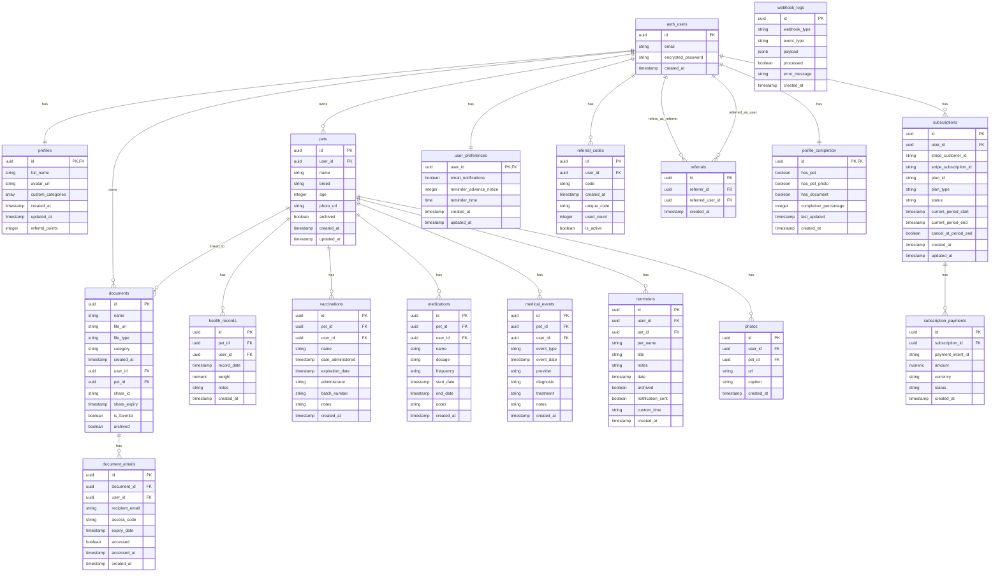

# Database Schema

This document provides a visual representation of the database schema for the Pet Document application.

## Complete Database Schema

## Key Relationships

- **Users (auth_users)** are at the center, connected to profiles, pets, documents, and subscriptions
- **Pets** are connected to health records, vaccinations, medications, medical events, reminders, and photos
- **Documents** can be linked to pets and have document emails
- The **referral system** connects users through referrals and referral codes
- **Subscriptions** track user payment status and have associated payments

## Table Descriptions

### User Management
- **auth_users**: Supabase built-in authentication table
- **profiles**: User profile information
- **user_preferences**: User settings for notifications and reminders
- **profile_completion**: Tracks user onboarding progress

### Pet Management
- **pets**: Basic pet information
- **health_records**: Pet health tracking
- **vaccinations**: Pet vaccination records
- **medications**: Pet medication tracking
- **medical_events**: Vet visits and other medical events
- **photos**: Pet photo gallery

### Document Management
- **documents**: Pet-related documents (medical records, certificates, etc.)
- **document_emails**: Tracks document sharing via email

### Subscription & Payment
- **subscriptions**: User subscription status
- **subscription_payments**: Payment history
- **webhook_logs**: Stripe webhook event logs

### Referral System
- **referral_codes**: User referral codes
- **referrals**: Tracks successful referrals