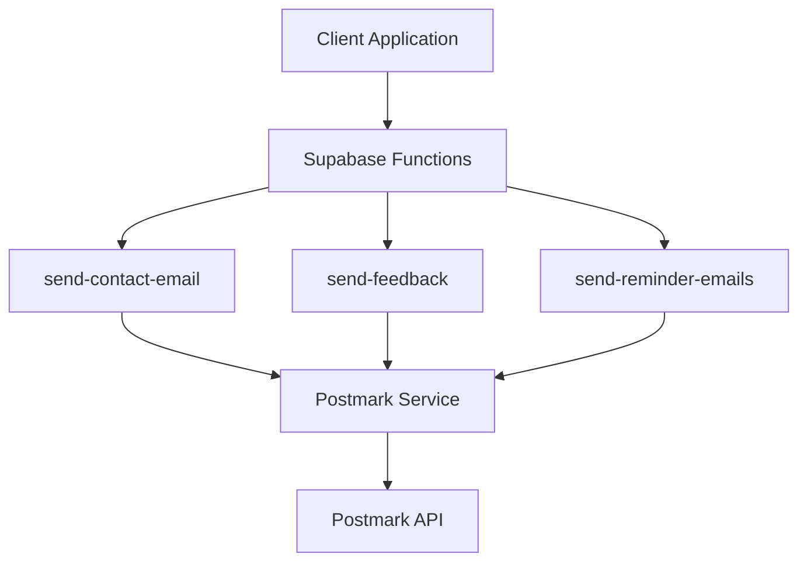

# Postmark Email Implementation Plan

This document outlines the implementation plan for integrating Postmark email functionality into the PetDocument application.

## 1. Architecture Overview



## 2. Implementation Steps

### 2.1 Create Shared Modules

1. Create a `_shared` directory in the `supabase/functions` folder
2. Create the Postmark service module (`_shared/postmark.ts`)
3. Create the JWT validation middleware (`_shared/auth.ts`)

### 2.2 Update Existing Functions

1. Update `send-feedback` function to use the shared Postmark service
2. Update `send-contact-email` function to use the shared Postmark service
3. Update `send-reminder-emails` function to use the shared Postmark service

## 3. Detailed Implementation

### 3.1 Shared Postmark Service (`_shared/postmark.ts`)

This module provides:
- Postmark client initialization with API token
- Email sending functionality with proper error handling
- Support for plain text, HTML, and template-based emails
- Default sender email configuration (support@petdocument.com)
- Type definitions for email data

The Postmark service includes:

1. **Email Data Interface**:
   ```typescript
   export interface EmailData {
     to: string;
     from?: string; // Optional, defaults to support@petdocument.com
     subject: string;
     text?: string; // Plain text content
     html?: string; // HTML content
     templateId?: string; // Postmark template ID
     dynamicTemplateData?: Record<string, any>; // Data for template
   }
   ```

2. **Initialization**:
   - Retrieves the Postmark API token from environment variables
   - Initializes the Postmark client
   - Uses MessageStream: "outbound"

3. **Send Email Function**:
   - Validates required fields (to, subject, and at least one of text/html/templateId)
   - Sets default from email if not provided
   - Prepares the email message
   - Sends the email using Postmark
   - Returns success/failure with detailed error information if needed

4. **Error Handling**:
   - Detailed error logging
   - Structured error responses
   - Handling of Postmark-specific errors

### 3.2 JWT Validation Middleware (`_shared/auth.ts`)

This module provides:
- JWT validation using Supabase's built-in client library
- Token verification and user extraction
- CORS headers for browser requests
- Response helper functions
- Error handling for unauthorized requests

The JWT validation:
1. Extracts the JWT token from the Authorization header
2. Uses Supabase's `auth.getUser(token)` method to verify the token and get the user
3. Returns the user ID if verification is successful
4. Returns an error if verification fails

### 3.3 Updated Functions

Each function has been updated to:
- Import and use the shared Postmark service
- Implement JWT validation
- Add proper error handling and logging

## 4. Testing

The `test-postmark.ts` script can be used to verify the Postmark email service:

```bash
deno run --allow-env --allow-net supabase/functions/test-postmark.ts
```

## 5. Environment Variables

The following environment variables must be set:

| Variable | Description | Example |
|----------|-------------|---------|
| `POSTMARK_API_TOKEN` | API token for Postmark |  
