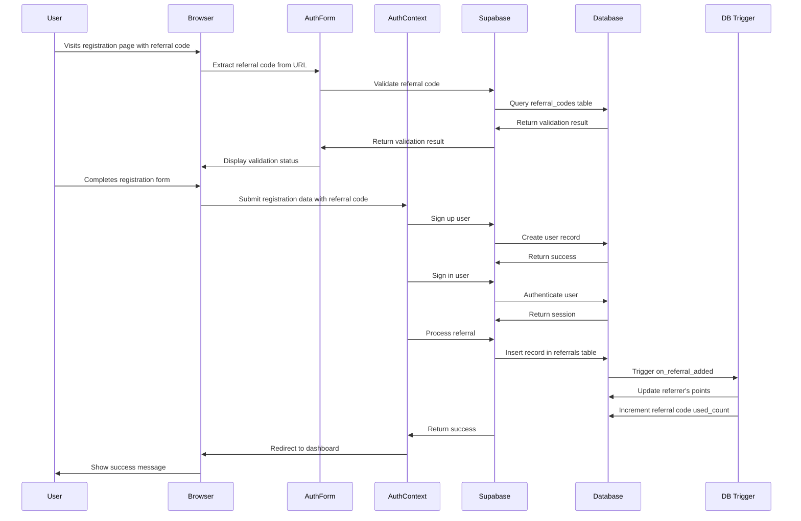
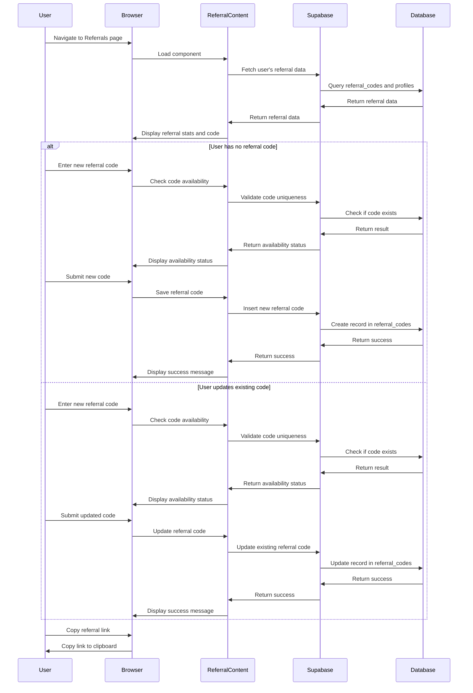

# Referral System Documentation

## Overview

The referral system allows users to refer friends to the platform and earn rewards for successful referrals. Users can create and customize their own unique referral codes, which they can share with others. When new users register using these referral codes, the referrer earns points, and the system tracks these successful referrals.

## Database Structure

The referral system uses three main database tables:

### 1. `referral_codes` Table

Stores the unique referral codes created by users.

```sql
CREATE TABLE public.referral_codes (
    id UUID PRIMARY KEY DEFAULT gen_random_uuid(),
    user_id UUID NOT NULL REFERENCES auth.users(id) ON DELETE CASCADE,
    code TEXT NOT NULL,
    created_at TIMESTAMPTZ DEFAULT NOW(),
    unique_code TEXT UNIQUE,
    used_count INTEGER DEFAULT 0,
    is_active BOOLEAN DEFAULT TRUE,
    CONSTRAINT unique_user_referral_code UNIQUE (user_id)
);
```

- `id`: Unique identifier for the referral code
- `user_id`: The user who created the referral code
- `code`: The original referral code (may be system-generated)
- `unique_code`: The customized, unique referral code that users share
- `used_count`: Number of times this code has been successfully used
- `is_active`: Whether the code is currently active

### 2. `referrals` Table

Records successful referrals when a new user registers using a referral code.

```sql
CREATE TABLE public.referrals (
    id UUID PRIMARY KEY DEFAULT gen_random_uuid(),
    referrer_id UUID NOT NULL REFERENCES auth.users(id) ON DELETE CASCADE,
    referred_user_id UUID NOT NULL REFERENCES auth.users(id) ON DELETE CASCADE,
    created_at TIMESTAMPTZ DEFAULT NOW(),
    CONSTRAINT unique_referred_user UNIQUE (referred_user_id)
);
```

- `id`: Unique identifier for the referral
- `referrer_id`: The user who provided the referral code
- `referred_user_id`: The new user who registered using the referral code
- `created_at`: When the referral was recorded
- `unique_referred_user`: Constraint ensuring each user can only be referred once

### 3. `profiles` Table (Referral Points Column)

The existing `profiles` table includes a `referral_points` column to track points earned from successful referrals.

```sql
ALTER TABLE public.profiles
ADD COLUMN referral_points INTEGER DEFAULT 0;
```

## User Flows

### Referrer Flow: Creating and Sharing a Referral Code

1. User navigates to the Referrals page
2. If the user doesn't have a referral code yet:
   - They can create a new custom code
   - The system validates the code's uniqueness
   - Upon submission, the code is saved to the database
3. If the user already has a referral code:
   - They can view their current code and stats
   - They can update their code if desired
4. User can copy their referral link to share with others
5. The referral link format is: `{origin}/register?ref={referralCode}`

### Referee Flow: Registering with a Referral Code

1. New user visits the registration page, possibly with a referral code in the URL
2. If a referral code is present in the URL, it's automatically extracted and populated
3. User can also manually enter a referral code
4. The system validates the referral code's existence
5. User completes registration with the valid referral code
6. Upon successful registration, the system:
   - Creates a new referral record
   - Increments the referrer's points
   - Updates the referral code's usage count

## Sequence Diagrams

### Registration with Referral Code



### Referral Code Creation and Management



## Backend Processing

### Database Triggers

The system uses a database trigger to automatically update referral points and usage counts when a new referral is recorded:

```sql
CREATE TRIGGER on_referral_added
AFTER INSERT ON public.referrals
FOR EACH ROW
EXECUTE FUNCTION increment_referral_points();
```

### Functions

The `increment_referral_points` function handles the point incrementation and usage count updates:

```sql
CREATE OR REPLACE FUNCTION public.increment_referral_points()
RETURNS TRIGGER
LANGUAGE plpgsql
SECURITY DEFINER
AS $function$
BEGIN
  -- Increment the referrer's points, handling NULL values
  UPDATE public.profiles
  SET referral_points = COALESCE(referral_points, 0) + 1
  WHERE id = NEW.referrer_id;
  
  -- Increment the used_count for the referral code, handling NULL values
  UPDATE public.referral_codes
  SET used_count = COALESCE(used_count, 0) + 1
  WHERE user_id = NEW.referrer_id;
  
  RETURN NEW;
END;
$function$;
```

The system also provides a function to check if a referral code is available:

```sql
CREATE OR REPLACE FUNCTION public.is_referral_code_available(code_to_check TEXT)
RETURNS BOOLEAN
LANGUAGE plpgsql
SECURITY DEFINER
AS $function$
BEGIN
  RETURN NOT EXISTS (
    SELECT 1 FROM public.referral_codes
    WHERE LOWER(unique_code) = LOWER(code_to_check)
  );
END;
$function$;
```

### Row-Level Security Policies

The system implements the following RLS policies to secure the referral data:

#### For `referral_codes` table:

```sql
-- Anyone can view referral codes (needed for validation)
CREATE POLICY "Users can view any referral code"
ON public.referral_codes
FOR SELECT
TO public
USING (true);

-- Users can only create their own referral codes
CREATE POLICY "Users can insert their own referral codes"
ON public.referral_codes
FOR INSERT
TO public
WITH CHECK (auth.uid() = user_id);

-- Users can only update their own referral codes
CREATE POLICY "Users can update their own referral codes"
ON public.referral_codes
FOR UPDATE
TO public
USING (auth.uid() = user_id);
```

#### For `referrals` table:

```sql
-- Allow insertion of referrals (needed during registration)
CREATE POLICY "System can insert referrals"
ON public.referrals
FOR INSERT
TO public
WITH CHECK (true);

-- Users can only view referrals where they are the referrer
CREATE POLICY "Users can view their own referrals"
ON public.referrals
FOR SELECT
TO public
USING (auth.uid() = referrer_id);
```

## Frontend Components

### Key Components

1. **Referrals.tsx**: The main page component for the referral system
   - Provides the layout and styling for the referral page
   - Renders the ReferralContent component

2. **ReferralContent.tsx**: The core component for referral management
   - Fetches and displays the user's referral data
   - Handles creation and updating of referral codes
   - Provides functionality to copy the referral link
   - Shows referral statistics (points and successful referrals)

3. **AuthForm.tsx**: Handles referral code input during registration
   - Extracts referral codes from URL parameters
   - Validates referral codes during form submission
   - Provides UI for entering and validating referral codes

4. **AuthContext.tsx**: Processes referrals after registration
   - Extracts referral code from registration data
   - Creates referral records in the database after successful registration
   - Handles any errors during the referral process

## Integration Points

The referral system integrates with several other parts of the application:

1. **Authentication System**: 
   - Referral codes are processed during user registration
   - The AuthContext handles the creation of referral records

2. **User Profiles**: 
   - The profiles table stores referral points
   - Referral points are displayed in the user's referral dashboard

3. **URL Parameters**: 
   - The system supports referral codes in URL parameters
   - This enables direct sharing of referral links

4. **Database Triggers**: 
   - Automatic updating of referral points and usage counts
   - Ensures data consistency across the system